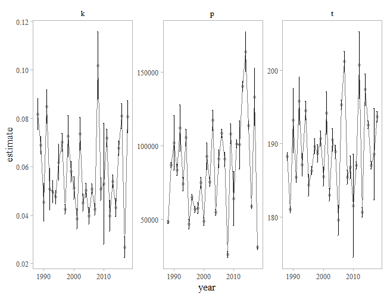
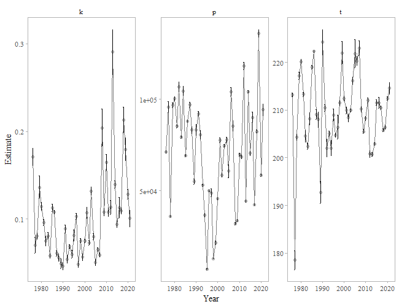

```{r setup, echo = FALSE, warning = FALSE, message = FALSE, error = FALSE}
library(knitr)
knitr::opts_chunk$set(echo = FALSE, warning=FALSE, message = FALSE, error=FALSE)
```

##Recipient(s)
Steve Heinl

##Background
The objectives of this analysis were to:  1.  Model (Gompertz or logistic) the tails of the run to quantify a hard ending date for weir operations – the date to which the weir would be required to be operated (e.g., would capture 95% of the escapement on average);  2. Estimate % of counts missed (with 95% CI) if project was operated past the hard ending date until daily counts equaled less than 1% of cumulative count for 3, 4, or 5 days in a row.  3. Analyze the Situk River and Chilkoot Lake sockeye salmon weir data to determine the hard ending date the weir is required to be operated and the percent of missed counts if the project was operated past the hard ending date until daily counts equaled less than 1% of cumulative count for 3, 4, or 5 days in a row. All associated files, data, and code are located on GitHub https://github.com/commfish/weiRends.

###Data
The data format is two columns with date (preferably in year-mm-dd format) and weir count data. An example is:
date       count  
2019-01-20  20

This is for a single species at a single weir. No other values or comments should be 
added to the file. It should preferably be in .csv format. 

###Analysis
The Gompertz model is written as $$p\mathrm{e}^{{-e}^{-k(t-t_0)}}$$ and the logistic model is written as $$\frac{p}{\mathrm{1+e}^{-k(t-t_0)}}.$$ 
In the Gompertz model, p represents the asymptote of the cumulative escapement, k is the steepness of the curve, and t_0 is the inflection point of the curve. 


For the analysis for each stock, all packages need to be loaded (see helper.r file) prior to running models. There are a set of 15 functions that need to be run in order.

1. f_clean_data = formats data for modeling
2. f_gomp_model = runs a Gompertz model for each year
3. f_logistic_model = runs a logistic model for each year
4. f_summary = examine model outputs
5. f_deviance = compare Gompertz and logistic models and proceed with best fitting model; If deviance >0.50, then the Gompertz Model is preferred, and if deviance <0.50, then the logistic model is preferred
6. f_params = get parameter outputs 
7. f_param_plot = plot parameter values 
8. f_preds = predict the model
9. f_pred_plot = examine predictions
10. f_run_through = the weir should be in place through this date
11. f_real_day = change julian date to a date people can understand
12. f_run_caught = percent of the run that is caught at a given risk level
13. f_risk_plot = percent of missed run at a given level of risk (the inverse of # 12)
14. f_run_risk = percent of risk at a given percent of missed run
15. f_median_end_dates = median, 25%, and 75% quantiles of weir removal dates (julian) for 1% rules

Each *stock*_analysis.r file sources the same functions and helper files.

##Methods
The Situk River (years 1988-2018) and Chilkoot Lake (years 1976-2018) sockeye salmon weir data were analyzed to determine the hard ending date the weir is required to be operated based on capturing 95% of the escapement on average using hoistorical data. Then, a risk anlysis was performed by calculating the percent of missed counts based on whether the project was operated past the hard ending date until daily counts equaled less than 1% of the cumulative count for 3, 4, or 5 days in a row. 

```{r situk_results}
source('code/helper.r')
source('code/functions.r')
read_csv('data/processed/situk_run_through.csv') -> run_through
read_csv('data/processed/situk_real_day.csv') -> real_day
read_csv('data/processed/situk_dev.csv') -> dev
```


##Results
####Situk River Sockeye Salmon Data
Based on the deviance criterion of `r dev`, the Gompertz model was the preferred model to model the tails of the run. The julian date that 95% of the modeled run has been observed - on average is julian day `r run_through` (`r real_day`).


```{r fig1, echo=FALSE}

```

Figure 1: Parameter estimates by year for the preferred model. 
\pagebreak

```{r fig2}
include_graphics("../figs/situk/preds_plot95.png")
```

Figure 2: Cumulative escapement by julian date and year with modelled tails. 
\pagebreak

```{r fig3}
include_graphics("../figs/situk/risk_plot.png")
```

Figure 3: 
  \pagebreak

```{r situk_results}
source('code/helper.r')
source('code/functions.r')
read_csv('data/processed/chilkoot_run_through.csv') -> run_through
read_csv('data/processed/chilkoot_real_day.csv') -> real_day
read_csv('data/processed/chilkoot_dev.csv') -> dev
```

####Chilkoot River Sockeye Salmon Data
Based on the deviance criterion of `r dev`, the logistic model was the preferred model to model the tails of the run. The julian date that that 95% of the modeled run has been observed - on average is `r run_through` (`r real_day`).

```{r fig4, echo=FALSE}

```

Figure 4: Parameter estimates by year for the preferred model. 


```{r fig5}
include_graphics("../figs/chilkoot/preds_plot95.png")
```

Figure 5: Cumulative escapement by julian date and year with modelled tails. 

```{r fig6}
include_graphics("../figs/chilkoot/risk_plot.png")
```

Figure 6: 
  
#Recommendations
  
  
  
  \pagebreak
```{r sess_info, echo=FALSE}
#sessionInfo()
```
