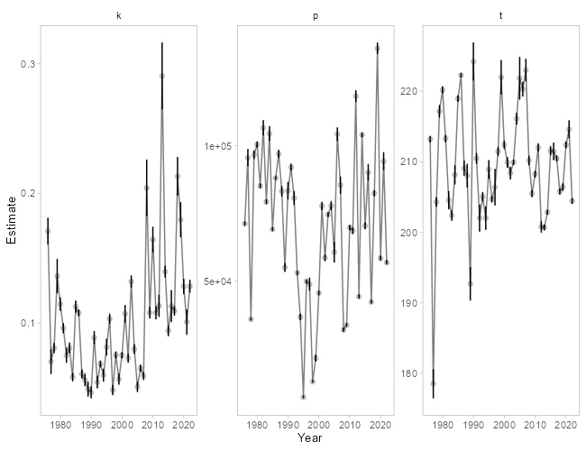

```{r setup, echo = FALSE, warning = FALSE, message = FALSE, error = FALSE}
library(knitr)
knitr::opts_chunk$set(echo = FALSE, warning=FALSE, message = FALSE, error=FALSE)
```

##Recipient(s)
Steve Heinl

##Background
The objectives of this analysis were to:  1.  Model (Gompertz or logistic) the tails of the run to quantify a hard ending date for weir operations – the date to which the weir would be required to be operated (e.g., would capture 95% of the escapement on average);  2. Estimate % of counts missed (with 95% CI) if project was operated past the hard ending date until daily counts equaled less than 1% of cumulative count for 3, 4, or 5 days in a row.  3. Analyze the Situk River and Chilkoot Lake sockeye salmon weir data to determine the hard ending date the weir is required to be operated and the percent of missed counts if the project was operated past the hard ending date until daily counts equaled less than 1% of cumulative count for 3, 4, or 5 days in a row. All associated files, data, and code are located on GitHub https://github.com/commfish/weiRends.

###Data
The data format is two columns with date (preferably in year-mm-dd format) and weir count data. An example is:
date       count  
2019-01-20  20

This is for a single species at a single weir. No other values or comments should be 
added to the file. It should preferably be in .csv format. 

###Analysis
The Gompertz model is written as $$p\mathrm{e}^{{-e}^{-k(t-t_0)}}$$ and the logistic model is written as $$\frac{p}{\mathrm{1+e}^{-k(t-t_0)}}.$$ 
In the Gompertz model, p represents the asymptote of the cumulative escapement, k is the steepness of the curve, and t_0 is the inflection point of the curve. 


For the analysis for each stock, all packages need to be loaded (see helper.r file) prior to running models. There are a set of 15 functions that need to be run in order.

1. f_clean_data = formats data for modeling
2. f_gomp_model = runs a Gompertz model for each year
3. f_logistic_model = runs a logistic model for each year
4. f_summary = examine model outputs
5. f_deviance = compare Gompertz and logistic models and proceed with best fitting model; If deviance >0.50, then the Gompertz Model is preferred, and if deviance <0.50, then the logistic model is preferred
6. f_params = get parameter outputs 
7. f_param_plot = plot parameter values 
8. f_preds = predict the model
9. f_pred_plot = examine predictions
10. f_run_through = the weir should be in place through this date
11. f_real_day = change julian date to a date people can understand
12. f_run_caught = percent of the run that is caught at a given risk level
13. f_risk_plot = percent of missed run at a given level of risk (the inverse of # 12)
14. f_run_risk = percent of risk at a given percent of missed run
15. f_median_end_dates = median, 25%, and 75% quantiles of weir removal dates (julian) for 1% rules

Each *stock*_analysis.r file sources the same functions and helper files.

##Methods
The Situk River (years 1988-2018) and Chilkoot Lake (years 1976-2018) sockeye salmon weir data were analyzed to determine the hard ending date the weir is required to be operated based on capturing 95% of the escapement on average using hoistorical data. Then, a risk anlysis was performed by calculating the percent of missed counts based on whether the project was operated past the hard ending date until daily counts equaled less than 1% of the cumulative count for 3, 4, or 5 days in a row. 

```{r deviance_Situk, echo=F, warning=F, message=F, error=F, include =F}
# load ----
source('code/helper.r')
source('code/functions.r')

# data ----
# data inputs are date (mm/dd/yyyy) and weir count

read_csv('data/situk_weir_1988-2018.csv') %>% 
  mutate (date = ifelse(stat_week == 24 & count == 35 & species =="Sockeye", "6/6/2016", date)) %>%      
  mutate (date = ifelse(stat_week == 26 & count == 657 & species =="Sockeye", "6/22/2016", date)) %>%    
  filter(species=='Sockeye') %>% 
  dplyr::select(date, count) -> situk

# run functions ----

# format data
f_clean_data(situk) -> df

# model
f_gomp_model(df) -> model

# model logistic function
f_logistic_model(df) -> model_logistic

# check model fits - did all models converge?
# if not may need to go into f_gomp_model and change the lower 
# and upper starting values isConv=TRUE
f_summary(model)
f_summary(model_logistic)

# which model performs better
# >0.50 = model 1
# <0.50 = model 2
f_deviance(model, model_logistic) -> dev
dev <- round(dev, 2)# check model fits - did all models converge?

# get parameters
f_params(model) -> params

# plot parameter fits - because why not?
f_param_plot(params)
ggsave("figs/situk/param_plot.png", dpi = 100, height = 5, width = 7, units = "in") 

# predict the model on a complete dataset
f_preds(df, model) -> preds

# plot the predicted data
f_pred_plot(preds)
ggsave("figs/situk/preds_plot.png", dpi = 100, height = 5, width = 7, units = "in") 

# plot in decadel scale so easier to read
preds %>%
  filter (year < 2001)-> year_subset
f_pred_plot(year_subset)
ggsave("figs/situk/preds_plot_decadel.png", dpi = 100, height = 5, width = 7, units = "in") 
preds %>%
  filter (year > 2000 )-> year_subset
f_pred_plot(year_subset)
ggsave("figs/situk/preds_plot_deacadel2.png", dpi = 100, height = 5, width = 7, units = "in") 

# what is the minimum day that the weir should be in place?
# the Julian date that 95% of the modeled run has been observed - on average
f_run_through(df, preds) -> run_through

#add figure that shows the average 95% (dotted vertical line) and 95% julian date by year
# modeled date to 95% of run
preds %>%
  group_by(year) %>%
  filter(fit_cumsum <= 0.95 * max(fit_cumsum)) %>%
  summarise(run_95 = max(julian))-> x

preds %>% 
  group_by(year) %>%
  left_join(x, .) %>% 
  mutate(julian95 = ifelse(julian == run_95, fit_cumsum, "")) %>%  
  mutate(julian95= as.numeric(julian95))-> preds_95

  preds_95 %>% 
    ggplot(aes(julian, fit_cumsum, color = Year, group = Year)) +
    geom_line() +
    geom_point(aes(y = cumsum), alpha= 0.15, pch=16) +
    geom_point(aes(y = julian95), alpha= 0.90, pch=8) +
    scale_y_continuous(labels = comma) +
    geom_vline(xintercept=run_through, lty=2) +
    xlab('\nJulian date') +
    ylab('Cumulative Escapement\n')
  ggsave("figs/situk/preds_plot95.png", dpi = 100, height = 5, width = 7, units = "in") 

# what is the minimum day that the weir should be in place?
# the Julian date that 95% of the modeled run has been observed - on average
f_run_through(df, preds) -> run_through

# the date in a more informative format
f_real_day(run_through) -> real_day

# dates the weirs would be removed based upon 1% rule
# for 5,4,3, or 2 days
f_remove_dates(preds, run_through) -> remove_dates

# Percent of the run that is caught at a given risk level
f_run_caught(preds, remove_dates)

# plot of missed run and risk
f_risk_plot(preds, remove_dates)
ggsave("figs/situk/risk_plot.png", dpi = 100, height = 5, width = 7, units = "in") 

# Percent of risk at a given % of missed run
f_run_risk(preds, remove_dates)

# Median, 25% and 75% quantiles of weir end date
f_median_end_date(remove_dates)
```

##Results
####Situk River Sockeye Salmon Data
Based on the deviance criterion of `r dev` the Gompertz model was the preferred model to model the tails of the run. The julian date that 95% of the modeled run has been observed - on average is `r run_through` (`r real_day`).


```{r fig1, echo=FALSE}
include_graphics("../figs/situk/param_plot.png")
```

Figure 1: Parameter estimates by year for the preferred model. 
\pagebreak

```{r fig2}
include_graphics("../figs/situk/preds_plot95.png")
```

Figure 2: Cumulative escapement by julian date and year with modelled tails. 
\pagebreak

```{r fig3}
include_graphics("../figs/situk/risk_plot.png")
```

Figure 3: 
  \pagebreak


```{r deviance_Chilkoot, echo=F, warning=F, message=F, error=F, include =F}
# load ----
source('code/helper.r')
source('code/functions.r')

# data ----
# data inputs are date (mm/dd/yyyy) and weir count

read_csv('data/chilkoot_weir_1976-2018.csv') %>% 
  filter(Species=='Sockeye') %>% 
  dplyr::select(date, count) -> chilkoot

# run functions ----

# format data
f_clean_data(chilkoot) -> df

# model Gompertz function
f_gomp_model(df) -> model

# model logistic function
f_logistic_model(df) -> model_logistic

# check model fits - did all models converge?
# if not may need to go into f_gomp_model and change the lower 
# and upper starting values isConv=TRUE
f_summary(model)
f_summary(model_logistic)

# which model performs better
# >0.50 = model 1
# <0.50 = model 2
f_deviance(model, model_logistic)-> dev2
dev2 <- round(dev2, 2)# check model fits - did all models converge?

# get parameters
f_params(model_logistic) -> params

# plot parameter fits - because why not?
# do any look out of place?
f_param_plot(params)
ggsave("figs/chilkoot/param_plot.png", dpi = 100, height = 5, width = 7, units = "in") 

# predict the model on a complete dataset
f_preds(df, model_logistic) -> preds 

# plot the predicted data
f_pred_plot(preds)
ggsave("figs/chilkoot/preds_plot.png", dpi = 100, height = 5, width = 7, units = "in") 

# plot the predicted data
f_pred_plot(preds)

# plot in decadel scale so easier to read
preds %>%
  filter (year< 1990)-> year_subset
f_pred_plot(year_subset)
ggsave("figs/chilkoot/preds_plot_decadel.png", dpi = 100, height = 5, width = 7, units = "in") 

preds %>%
  filter (year > 1989 & year < 2000 )-> year_subset
f_pred_plot(year_subset)
ggsave("figs/chilkoot/preds_plot_deacadel2.png", dpi = 100, height = 5, width = 7, units = "in")

preds %>%
  filter (year > 1999 )-> year_subset
f_pred_plot(year_subset)
ggsave("figs/chilkoot/preds_plot_deacadel3.png", dpi = 100, height = 5, width = 7, units = "in") 

# what is the minimum day that the weir should be in place?
# the Julian date that 95% of the modeled run has been observed - on average
f_run_through(df, preds) -> run_through

#add figure that shows the average 95% (dotted vertical line) and 95% julian date by year
# modeled date to 95% of run
preds %>%
  group_by(year) %>%
  filter(fit_cumsum <= 0.95 * max(fit_cumsum)) %>%
  summarise(run_95 = max(julian))-> x

preds %>% 
  group_by(year) %>%
  left_join(x, .) %>% 
  mutate(julian95 = ifelse(julian == run_95, fit_cumsum, "")) %>%  
  mutate(julian95= as.numeric(julian95))-> preds_95

preds_95 %>% 
  ggplot(aes(julian, fit_cumsum, color = Year, group = Year)) +
  geom_line() +
  geom_point(aes(y = cumsum), alpha= 0.15, pch=16) +
  geom_point(aes(y = julian95), alpha= 0.90, pch=8) +
  scale_y_continuous(labels = comma) +
  geom_vline(xintercept=run_through, lty=2) +
  xlab('\nJulian date') +
  ylab('Cumulative Escapement\n')
ggsave("figs/chilkoot/preds_plot95.png", dpi = 100, height = 5, width = 7, units = "in") 

# what is the minimum day that the weir should be in place?
# the Julian date that 95% of the modeled run has been observed - on average
f_run_through(df, preds) -> run_through

# the date in a more informative format
f_real_day(run_through) -> real_day 

# dates the weirs would be removed based upon 1% rule
# for 5,4,3, or 2 days
f_remove_dates(preds, run_through) -> remove_dates

# Percent of the run that is caught at a given risk level
f_run_caught(preds, remove_dates)

# plot of missed run and risk
f_risk_plot(preds, remove_dates)
ggsave("figs/chilkoot/risk_plot.png", dpi = 100, height = 5, width = 7, units = "in") 

# Percent of risk at a given % of missed run (same as above?????)
f_run_risk(preds, remove_dates)

# Median, 25% and 75% quantiles of weir end date
f_median_end_date(remove_dates)
```

####Chilkoot River Sockeye Salmon Data
Based on the deviance criterion of `r dev2` the logistic model was the preferred model to model the tails of the run. The julian date that that 95% of the modeled run has been observed - on average is `r run_through` (`r real_day`).

```{r fig4, echo=FALSE}

```

Figure 4: Parameter estimates by year for the preferred model. 


```{r fig5}
include_graphics("../figs/chilkoot/preds_plot95.png")
```

Figure 5: Cumulative escapement by julian date and year with modelled tails. 

```{r fig6}
include_graphics("../figs/chilkoot/risk_plot.png")
```

Figure 6: 
  
#Recommendations
  
  
  
  \pagebreak
```{r sess_info, echo=FALSE}
#sessionInfo()
```
